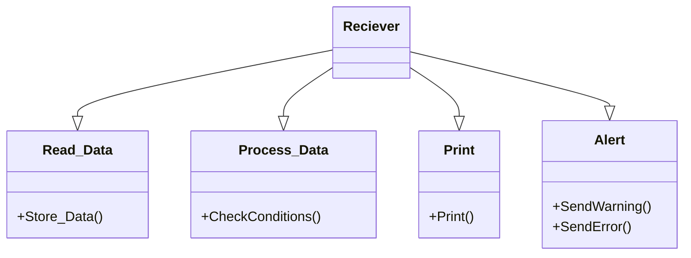

# Reciever Architecture

```mermaid
classDiagram
    Reciever --|> Read_Data
    Reciever --|> Process_Data
    Reciever --|> Print
    Reciever --|> Alert

    class Read_Data{
      +Store_Data()
    }
    class Process_Data{
      +CheckConditions()
    }
    class Print{
      +Print()
    }
    class Alert{
    +SendWarning()
    +SendError()
    }
```
            