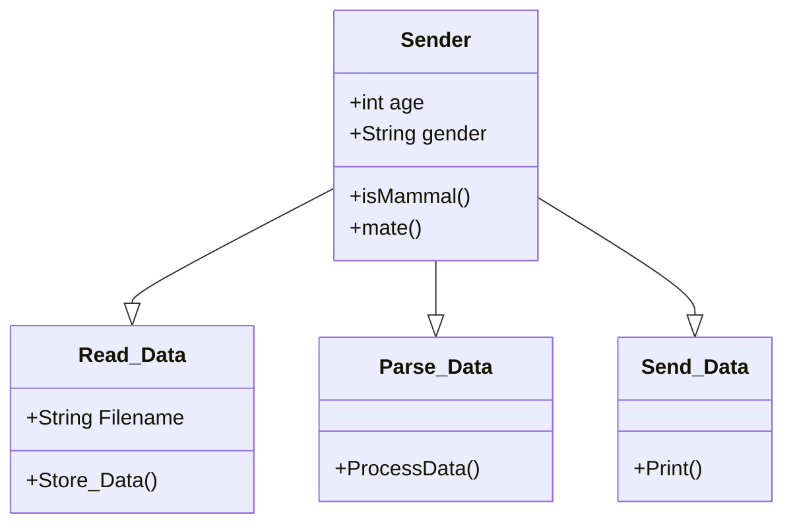

# Sender Architecture

```mermaid
classDiagram
    Sender --|> Read_Data
    Sender --|> Parse_Data
    Sender --|> Send_Data
    Sender : +int age
    Sender : +String gender
    Sender: +isMammal()
    Sender: +mate()
    class Read_Data{
      +String Filename
      +Store_Data()
    }
    class Parse_Data{
      +ProcessData()
    }
    class Send_Data{
      +Print()
    }
            
```